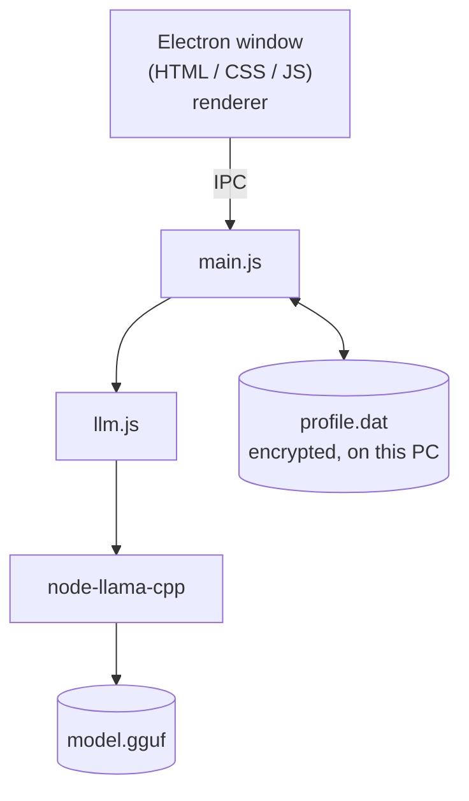

# BalanceBite

## About
A desktop app (Windows `.exe`) that suggests recipes for people managing a health condition. It has two modes: <br />
- Plan meal: It asks what groceries you have in your pantry, the nutrients you require in every meal
- Choose a new food: If you want to try something new and do not know how it might affect your health, just give the ingredients including all the stabilisers and preservatives from the printed list of information and it will tell you the after-effects, potion to be eaten in one sitting.

## Architecture


## Benefits
- The open weight models runs locally, thus no internet connection is required
- The application neither stores chat history nor sends data to server.
- The user is not required to create an account and the profile information saved is to avoid repititive questions and is stored locally.

## Use it yourself
1. Turn off the internet connection.
2. Launch the **BalanceBite.exe**.
3. Upload a photo, fill the four fields, Save.
4. Chat opens with your name. Answer groceries stock, then nutrients[don't skip].
5. Output card appears. Press **copy**, paste into Notepad. Press **download**, open the `.doc` in Word.
6. Close and reopen: profile is still there, chat is empty.
7. Tap your photo: profile opens with a back arrow, you can edit profile and save.
8. Put `peanuts` in Allergies, put peanut butter in stock: no recipe may contain it (hard filter in `llm.js`).

## Folder structure
```text
balance-bite/
├── models/
│   └── model.gguf
├── main.js
├── preload.js
├── llm.js
├── renderer/
│   └── app.js
│   └── index.html
│   └── style.css
├── package.json
└── package-lock.json
└── UI (design)
└── output (sample output)
└── .gitignore
└── README.md
└── LICENSE.md
└── SETUP.md
```

## Setup
If you want to setup this application, please refer to SETUP.md

## Output
For sample output, please refer to the output folder.

## Feedback
Have a feedback to share? Please send an email: saumili.work@gmail.com


<br />
<footer align="center">
BalanceBite Version 1.0.0
</footer>